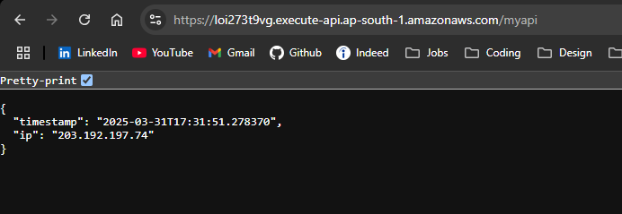

# SimpleTimeService

## Overview
SimpleTimeService is a lightweight microservice that returns the current timestamp and the client's IP address.

## Prerequisites
- Docker
- Terraform
- AWS CLI configured with credentials

## Deployment Steps

### Docker
1. Build the container:
docker build -t simpletimeservice .
2. Run the container:
docker run -p 5000:5000 simpletimeservice
3. Push to DockerHub:
docker tag simpletimeservice yourdockerhubusername/simpletimeservice:latest docker push yourdockerhubusername/simpletimeservice:latest

### Terraform Deployment (AWS ECS)
1. Navigate to the terraform directory:
cd terraform/
2. Initialize Terraform:
terraform init
3. Apply the configuration:
terraform apply -auto-approve

## Cleanup
To delete all resources:
terraform destroy -auto-approve

